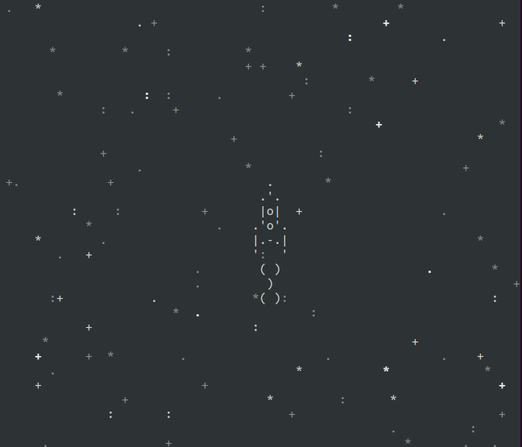

# Космическая игра в консоли.

Вы можете управлять ракетой стрелками на клавиатуре уклоняясь от мусора. Также 
по наступлению 2020 года появляется оружие (клавиша `space`).



## Запуск

Для запуска у вас уже должен быть установлен [Python 3](https://www.python.org/downloads/release/python-379/).

- Скачайте код.
- Установите зависимости командой:
```
pip install -r requirements.txt
```
- Запустите скрипт командой: 
```
python main.py
```
